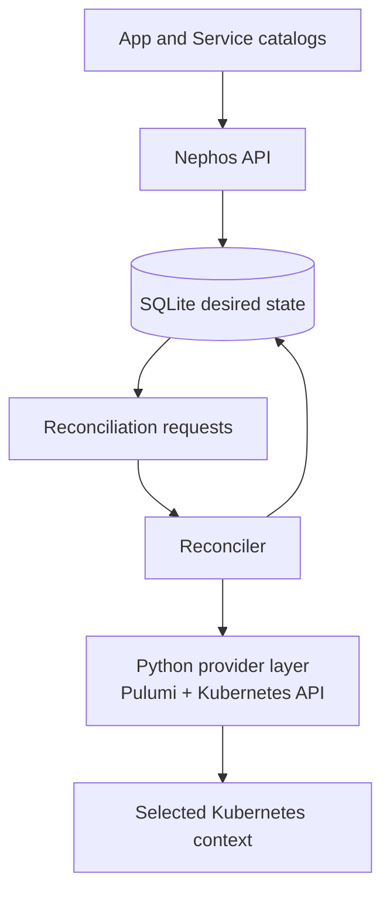
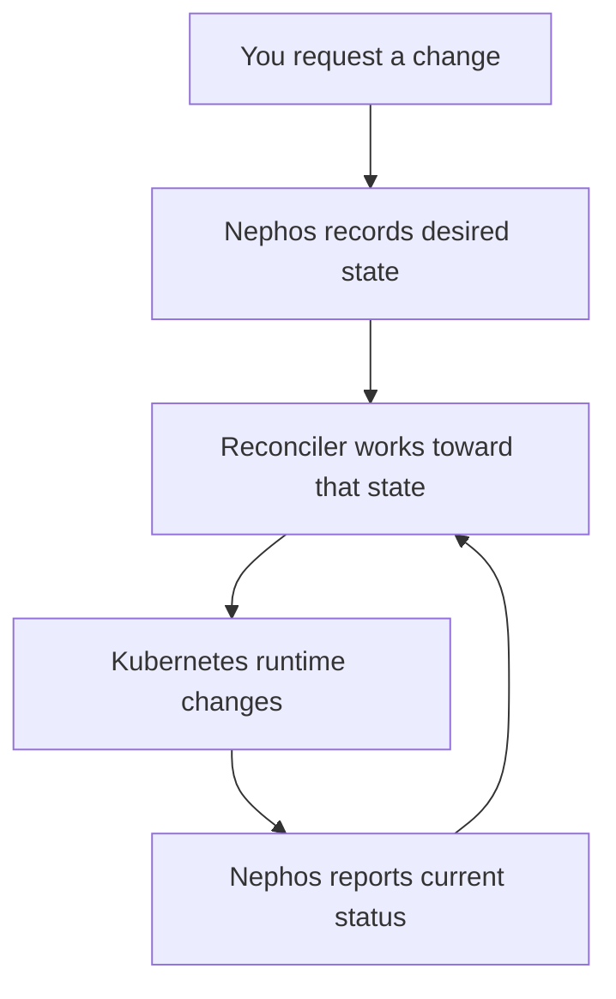

# Nephos

**Composable self-hosted infrastructure, managed as platform intent.**

Nephos is a local-first control plane for running Apps and shared Services on a
Kubernetes cluster you own. It gives self-hosted infrastructure a higher-level
API so installs are not a pile of one-off YAML, Helm values, secrets, and
`kubectl` commands.

With Nephos, Apps ask for capabilities. Services provide them. Nephos keeps the
desired platform state, reconciles runtime resources, and preserves lifecycle
semantics above raw Kubernetes objects.

> [!WARNING]
> Nephos is early and not production-ready. This repository currently contains
> the API 0.0.1 backend/control-plane slice.

## Contents

- [QuickStart](#quickstart)
- [Why Nephos](#why-nephos)
- [How It Works](#how-it-works)
- [Advanced: Why Reconciliation Exists](#advanced-why-reconciliation-exists)
- [What 0.0.1 Gives You](#what-001-gives-you)
- [Runtime Proof](#runtime-proof)
- [Maintainer Docs](#maintainer-docs)

## QuickStart

```bash
cp .env.example .env
# Edit NEPHOS_API_KUBE_CONTEXT if your Kubernetes context is not docker-desktop.

uv run nephos-api init
uv run nephos-api serve
```

Then open the API docs:

```text
http://127.0.0.1:8000/docs
```

That starts the Nephos API and its reconciler. It does not install Apps,
install Services, or mutate Kubernetes until you ask Nephos to install
something.

For local browser routes without editing `/etc/hosts`, keep this in `.env`:

```dotenv
NEPHOS_API_INTERNAL_DOMAIN=nephos.localhost
```

Your selected Kubernetes cluster still needs a reachable ingress controller.

## Why Nephos

Self-hosting gets ugly when every application owns its own database decisions,
secret wiring, lifecycle rules, ingress assumptions, and uninstall behavior.
Nephos moves those concerns into one platform control plane.

Nephos is built around a simple model:

- Apps are user-facing workloads.
- Services are shared platform capabilities.
- Capabilities describe what Apps need, such as `postgres`, `redis`, `s3`, or
  `search`.
- Bindings connect Apps to Services without hardcoding the concrete
  infrastructure into every App.
- Lifecycle actions preserve intent: stop, start, remove, destroy, and
  reconcile are platform operations, not raw Kubernetes deletes.

## How It Works



> [!IMPORTANT]
> SQLite is the source of truth for Nephos desired state. Kubernetes and Pulumi
> are provider/runtime state reconciled from that intent.

Nephos targets the Kubernetes context you select. The goal is not to expose raw
Kubernetes as the user experience; Kubernetes remains the runtime substrate.

## Advanced: Why Reconciliation Exists

When you ask Nephos to install or change something, the first job is to record
what you want. The reconciler is the part that turns that saved intent into
running infrastructure.



That separation matters because real infrastructure is not instant:

- a cluster can be slow, busy, or temporarily unavailable
- an App may need a Service, a binding Secret, and an Ingress before it is
  usable
- stopping an App should preserve data instead of deleting everything
- destroying something should be explicit and traceable
- Nephos should remember what you wanted even if the runtime is not ready yet

For the user, reconciliation is what makes Nephos a control plane instead of a
command wrapper. You describe the platform state you want; Nephos keeps working
toward it, records progress, and exposes status back through the API.

## What 0.0.1 Gives You

- FastAPI backend and `nephos-api` CLI.
- SQLite desired-state database and migrations.
- Catalog loading and validation for Apps and Services.
- API resources for Apps, Services, Bindings, Platform Domains, Catalog, and
  lifecycle actions.
- Serialized reconciliation worker.
- Python provider layer using Pulumi and the Kubernetes API under the hood.
- PostgreSQL Service provisioning and App binding materialization.
- Ingress generation with explicit or auto-detected `IngressClass`.
- Local development route support through `nephos.localhost`.

## Runtime Proof

```bash
uv run nephos-api dev smoke
```

The smoke command proves the end-to-end path: Nephos writes desired state,
reconciles a reference Service and App, provisions an app-scoped binding,
checks route convergence, exercises lifecycle, and cleans up Nephos-owned
runtime resources.

## Maintainer Docs

<details>
<summary>Operational and implementation references</summary>

- Manual testing:
  [docs/testing/api-0-0-1-manual.md](docs/testing/api-0-0-1-manual.md)
- Current implementation plan:
  [PLANS.md](PLANS.md)
- Architecture context:
  [.agents/context/](.agents/context/)
- Architecture decision records:
  [docs/adr/](docs/adr/)

</details>
