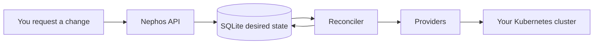

# Nephos

**Run composable self-hosted Apps and shared Services as platform intent.**

Nephos is an early local-first control plane for self-hosted infrastructure. It
lets Apps ask for capabilities such as PostgreSQL, object storage, search, or
auth, then lets Services provide those capabilities without every App owning its
own secret wiring, lifecycle rules, and Kubernetes YAML.

> [!WARNING]
> Nephos is not production-ready. This repository currently contains the
> `nephos-api` 0.0.1 backend/control-plane slice.

## What you can do today

- Start the Nephos API and browse its OpenAPI docs.
- Keep desired platform state in a local SQLite database.
- Load App and Service catalogs from local catalog roots.
- Install Apps and Services through the API as desired state.
- Let the reconciler converge supported provider-backed resources into a
  Kubernetes cluster you choose.
- Run the bundled runtime smoke proof for the reference PostgreSQL Service and
  reference web App.

## Core ideas

| Term | Meaning |
| --- | --- |
| **App** | A user-facing workload or product, such as a dashboard or personal cloud app. |
| **Service** | Shared platform infrastructure, such as PostgreSQL, Redis, S3, auth, or search. |
| **Capability** | What an App needs and a Service provides, such as `postgres` or `redis`. |
| **Binding** | The connection between an App requirement and the Service instance that satisfies it. |
| **Lifecycle** | User intent such as `start`, `stop`, `remove`, or `destroy`, preserved above raw Kubernetes objects. |

Nephos records what you want first. A reconciler then works toward that desired
state in the selected Kubernetes cluster.



## Quick start

### 1. Configure local settings

The initial Nephos API config has exactly one preconfigured registry dependency:
the first-party `core-registry`. Nephos manages that checkout itself under
`.nephos/registries/core-registry`; you do not clone it by hand.

```bash
cp .env.example .env
```

The default development shape is:

```dotenv
NEPHOS_API_DB_PATH=.nephos/state/nephos.db
NEPHOS_API_INTERNAL_DOMAIN=nephos.localhost
```

Kubernetes and Pulumi settings are optional until you are ready to test runtime
reconciliation against a disposable local cluster.

For local browser routes without editing `/etc/hosts`, keep:

```dotenv
NEPHOS_API_INTERNAL_DOMAIN=nephos.localhost
```

Your selected Kubernetes cluster still needs a reachable ingress controller once
you start runtime reconciliation.

### 2. Initialize local Nephos state

```bash
uv run nephos-api init
```

This applies database migrations and creates the default internal platform
domain. It does **not** install Apps, install Services, or mutate Kubernetes.

### 3. Start the API

```bash
uv run nephos-api serve
```

Open the interactive API docs:

```text
http://127.0.0.1:8000/docs
```

Check the API from a terminal:

```bash
curl -sS http://127.0.0.1:8000/version
curl -sS http://127.0.0.1:8000/healthz
```

Expected responses:

```json
{"name":"nephos-api","version":"0.0.1"}
{"status":"ok"}
```

## Runtime smoke proof

If your `.env` points to a safe local Kubernetes cluster, run:

```bash
uv run nephos-api dev smoke
```

The smoke command creates temporary reference catalog entries, installs a
PostgreSQL Service and a reference web App through Nephos desired state,
reconciles them through the provider layer, verifies binding and route behavior,
exercises lifecycle actions, and cleans up Nephos-owned runtime resources.

Expected final shape:

```text
Reference smoke test passed: app=<slug> service=<slug> url=http://<slug>.nephos.localhost
```

## Using the API

With the server running, common read endpoints are:

| Purpose | Endpoint |
| --- | --- |
| Health | `GET /healthz` |
| Version | `GET /version` |
| Catalog Apps | `GET /catalog/apps` |
| Catalog Services | `GET /catalog/services` |
| Installed Apps | `GET /apps` |
| Installed Services | `GET /services` |
| Bindings | `GET /bindings` |
| Platform domains | `GET /platform/config/domains` |

Install requests record desired state and return `202 Accepted`. Reconciliation
then works toward the requested state. The examples below use entries from the
managed `core-registry`; the bundled smoke command creates its own temporary
reference catalog for the proof flow.

Example Service install request:

```bash
curl -sS -X POST http://127.0.0.1:8000/services \
  -H 'content-type: application/json' \
  -d '{
    "catalogRef": {"kind": "Service", "name": "postgres"},
    "instanceName": "postgres"
  }'
```

Example App install request with explicit binding providers after the required
Services have been installed:

```bash
curl -sS -X POST http://127.0.0.1:8000/apps \
  -H 'content-type: application/json' \
  -d '{
    "catalogRef": {"kind": "App", "name": "nephos-console"},
    "instanceName": "nephos-console",
    "bindings": {
      "identity": {"serviceInstance": "zitadel"},
      "internal-routing": {"serviceInstance": "traefik"}
    }
  }'
```

## Environment variables

| Variable | Purpose |
| --- | --- |
| `NEPHOS_API_DB_PATH` | SQLite desired-state database path. Defaults to `.nephos/state/nephos.db`. |
| `NEPHOS_API_CORE_REGISTRY_URL` | Optional override for the managed first-party core registry URL. Defaults to `https://git.fcrozetta.app/nephos/core-registry.git`. |
| `NEPHOS_API_CORE_REGISTRY_PATH` | Optional override for the managed first-party core registry checkout path. Defaults to `.nephos/registries/core-registry`. |
| `NEPHOS_API_CATALOG_ROOTS` | Escape hatch for local catalog experiments, separated by your OS path separator. When set, it replaces the managed core-registry dependency set. |
| `NEPHOS_API_KUBECONFIG` | Optional kubeconfig path. Uses the default kubeconfig when unset. |
| `NEPHOS_API_KUBE_CONTEXT` | Kubernetes context Nephos should target. |
| `NEPHOS_API_INTERNAL_DOMAIN` | Default internal App route suffix. Use `nephos.localhost` for local browser testing. |
| `NEPHOS_API_INGRESS_CLASS` | Optional IngressClass override when auto-detection is ambiguous. |
| `NEPHOS_API_RUN_KUBERNETES_TESTS` | Set to `1` only when running opt-in Kubernetes integration tests. |
| `PULUMI_CONFIG_PASSPHRASE` | Local Pulumi backend passphrase needed by provider-backed runtime smoke flows. |

## Current limitations

- Nephos 0.0.1 is an API/backend slice, not the final user-facing CLI product.
- Cluster lifecycle is external; this repository does not create, start, stop,
  or destroy your Kubernetes cluster.
- Catalog and provider support is still narrow. A `202 Accepted` response means
  desired state was recorded, not that every runtime provider is implemented.
- Use a disposable local cluster and temporary database while experimenting.

## Maintainers and contributors

The README is intentionally user-focused. Maintainer workflow, verification,
architecture context, and ADR links live in [docs/maintainers.md](docs/maintainers.md).
