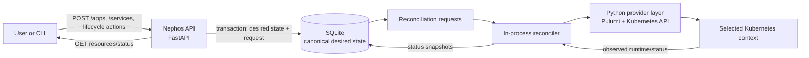
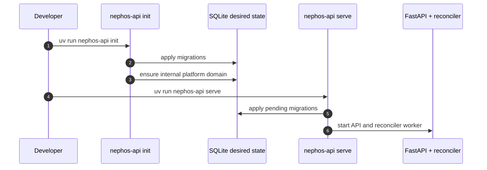
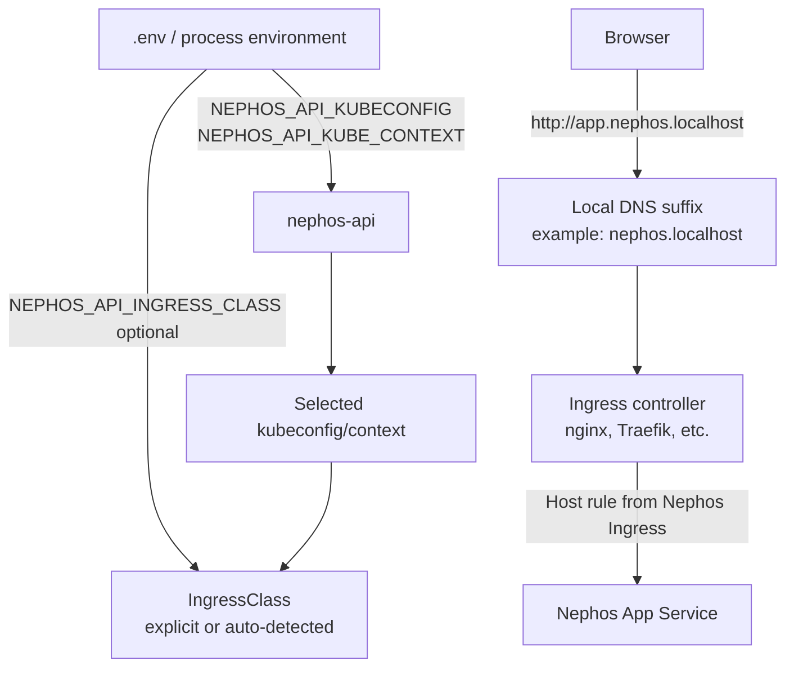

# nephos

Nephos API 0.0.1 backend/control-plane implementation.

Manual test instructions: [docs/testing/api-0-0-1-manual.md](docs/testing/api-0-0-1-manual.md).

## How Nephos Works

Nephos is a desired-state control plane. API calls write platform intent into
SQLite, then the reconciler converges Nephos-owned runtime resources into the
selected Kubernetes context.



> [!IMPORTANT]
> SQLite is the source of truth for Nephos desired state. Kubernetes and Pulumi
> are observed runtime/provider state, not the canonical platform model.

## Minimal Backend Flow

```bash
uv run nephos-api init
uv run nephos-api serve
```



`init` does not install Apps, install Services, mutate Kubernetes, run Helm, or
create runtime reconciliation requests.

## Runtime And Ingress

Nephos targets the Kubernetes context selected by kubeconfig and environment,
not a specific Kubernetes distribution.



> [!NOTE]
> Ingress controllers do not provide DNS. `nephos.localhost` is the local
> no-hosts development suffix; `nephos.local` remains the semantic fallback
> internal domain.

## Runtime Proof

```bash
uv run nephos-api dev smoke
```

The smoke command creates a temporary internal reference catalog, installs a
PostgreSQL Service and reference web App through the API/reconciler, verifies
binding materialization and route convergence, checks stop/start lifecycle, and
destroys the reference resources.
