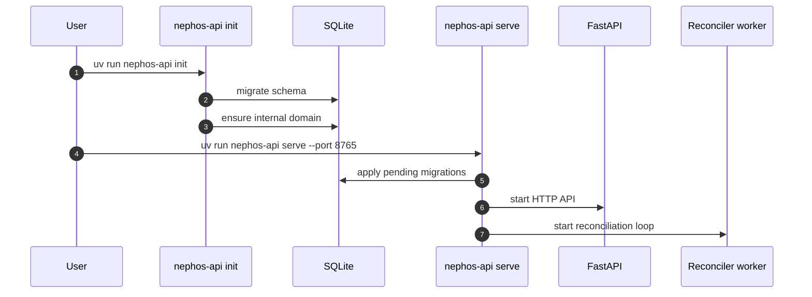
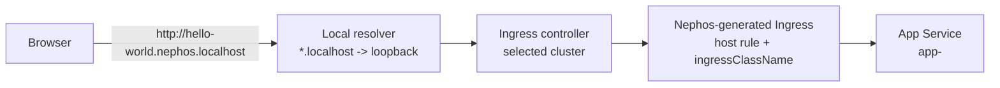
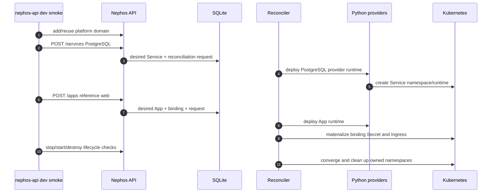

# API 0.0.1 Manual Testing

This repo does not manage cluster lifecycle. Use an existing Kubernetes
cluster, then point Nephos API at that context.

## Environment

Create `.env` in the repository root:

```dotenv
NEPHOS_API_DB_PATH=/private/tmp/nephos-manual/nephos.db
NEPHOS_API_KUBE_CONTEXT=docker-desktop
NEPHOS_API_INTERNAL_DOMAIN=nephos.localhost
# Optional when the selected cluster has multiple IngressClasses or no default.
# NEPHOS_API_INGRESS_CLASS=nginx
NEPHOS_API_RUN_KUBERNETES_TESTS=1
PULUMI_CONFIG_PASSPHRASE=local-dev
```

If the kubeconfig is not the default local kubeconfig, add:

```dotenv
NEPHOS_API_KUBECONFIG=/path/to/kubeconfig
```

Nephos loads `.env` from the process working directory. Real environment
variables override `.env`.

## Bare Minimum Backend

```bash
uv run nephos-api init
uv run nephos-api serve --port 8765
```



`init` loads `.env`, applies database migrations, creates local Nephos API
state, and ensures one default internal root domain. If no domain is passed,
the fallback internal domain is `nephos.local`.

For local browser testing without editing `/etc/hosts`, keep
`NEPHOS_API_INTERNAL_DOMAIN=nephos.localhost` in `.env`. Then generated App
URLs use hosts like:

```text
http://hello-world.nephos.localhost
```

This solves local hostname resolution only. A reachable Kubernetes ingress
controller is still required.

Nephos sets `ingressClassName` automatically when the selected cluster exposes
exactly one `IngressClass` or one default `IngressClass`. If the cluster has
multiple classes and no default, set `NEPHOS_API_INGRESS_CLASS` in `.env`.



> [!IMPORTANT]
> `nephos.localhost` solves only local hostname resolution. The selected
> Kubernetes cluster still needs a reachable ingress controller.

To choose a different internal domain:

```bash
uv run nephos-api init --internal-domain home.test
```

`init` does not install Apps, install Services, mutate Kubernetes, run Helm, or
create runtime reconciliation requests.

Verify the running API:

```bash
curl -sS http://127.0.0.1:8765/version
curl -sS http://127.0.0.1:8765/healthz
```

Expected:

- `/version` returns `{"name":"nephos-api","version":"0.0.1"}`
- `/healthz` returns `{"status":"ok"}`

## Runtime Proof

```bash
uv run nephos-api dev smoke
```

What it does:

- applies database migrations
- creates an internal temporary reference catalog
- uses Nephos API desired state to install a PostgreSQL Service and reference
  web App
- reconciles through internal Python Pulumi/Kubernetes providers
- provisions an app-scoped PostgreSQL binding
- creates the App binding Secret and route Ingress
- verifies stop/start lifecycle
- destroys the reference App and Service
- deletes only Nephos-owned namespaces



It does not require a local chart server, a manually prepared catalog root, or
manual Helm commands.

Expected final line:

```text
Reference smoke test passed: app=<slug> service=<slug> url=http://<slug>.nephos.localhost
```

## Test Suite Runtime Proof

The test target is whichever Kubernetes cluster `NEPHOS_API_KUBECONFIG` and
`NEPHOS_API_KUBE_CONTEXT` select.

```bash
uv run pytest tests/test_kubernetes_runtime_integration.py -m kubernetes -q
```

Expected:

```text
3 passed
```
